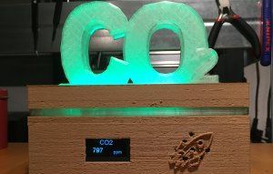
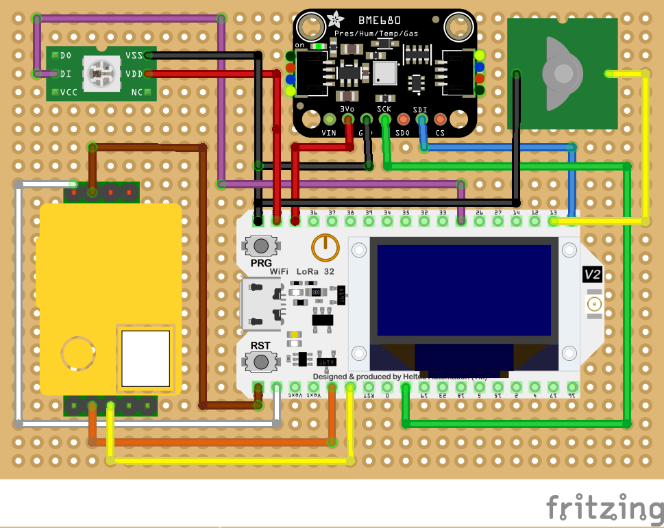

***CO2-Messgerät/Ampel***

[Weitere Fotos in der Galerie](https://gitlab.com/lora-lab-nrw/co2-meter/-/tree/master/Galerie) oder auf 
[Thingiverse](https://www.thingiverse.com/thing:4644826)

Ziel dieses IOT-Projekt ist es, eine einfache Variante eines CO2-Messgerätes zum Nachbauen zu entwickeln, Gedacht für den Einsatz in Schul- bzw. Klassenräumen. 

Das Gerät soll den Personen im Klassenzimmer signalisieren, dass die Luft im Raum einen erhöhten Gehalt an CO2 hat und dass dieser Raum gelüftet werden sollte. Das Gerät zeigt ein Warnsignal in Form einer Farbampel an. Die einzelnen Sensorwerte werden auf einem Display ausgegeben. 

Achtung: In der aktuellen Version wird der HelTec Lora Wifi v2 als Microcontroller benutzt. Die Daten werden außerdem nur per LoRaWAN übertragen. An der WiFi Variante mit einem Amica wird gearbeitet.

Gemessen werden Temperatur (C), Feuchte (%), CO2 (ppm), Luftdruck(hPa) und die Luftqualität (flüchtige organische Verbindungen, VOC).

Sensordaten werden via **LoRa WAN ** an thethingsnetwork übertragen und von dort aus thingsspeak.com grafisch aufbereitet.

Die Nutzung von LoRaWAN als Funkübertragungstechnik hat wegen dessen hohen Reichweite den Vorteil, Geräte über einen Indoor Gateway auf großer Fläche verbunverbinden zu können. Aber auch als Ausblick in die Zukunft, weil immer mehr Gateways große Gebiete in Ballungsräumen mit LoRaWAN abdecken, ist davon auszugehen, dass so ein CO2 Meter in naher Zukunft auch ohne eigenen Gateway Daten überträgt. Kostenlos und einfach so....

**Der Code für eine Version welche Daten per WiFi sendet folgt in Kürze.**

In weiteren Schritten soll das modular aufgebaute Gehäuse erweitert werden, um zu demonstrieren, dass die bisherigen Funktionen leicht durch andere Sensoren ergänzt oder ersetzt werden können. In Arbeit ist ein alternativer Gehäusedeckel mit größerem 1.8" TFT Diplay, welches das CO2 Symbol ersetzt und zeigt, dass das Gerät auch vertikal aufgestellt werden kann. Außerdem ist der Austausch des BlueDot Luftsensor durch einen dB Sensor geplant damit aus einem CO2 Messgerät ohne Aufwand ein Schallpegel Messgerät wird. Denkbar sind auch Mesh-Wegweiser oder die Erfassung der Bodenfeuchte von Klassenzimmerpflanzen.

In dieser Version wird ein HelTec LoRa WiFi Microcontroller in Verbindung mit einem günstigen MH-Z19B Infrarot CO2 Sensor und einen BME680 Luftqualitätssesor benutzt. Außerdem 8 Neopixel (WS2812b) und ein touch button sensor. Bis auf den CO2 Sensor, der mit 5V betrieben wird, läuft alles andere mit 3.3V Der CO2 Sensor wird seriell über die RX/TX Pins abgefragt. Der Luftqualitätssensor kommuniziert über den i2c bus (SDA:Pin 21), SCK:Pin 22) Die Neopixel müssen mit PIN 25 verbunden werden. Der Touchbutton ist t4 im Sketch, aber es können auch alle anderen verwendet werden solange dies im sketch auch angegeben wird.

**Kabelfarben:**

- 5V / GND = rot/schwarz
- 3.3V /GND = weiß/schwarz
- i2c sda = blau 
- i2c sck = grün
- Seriell RX = orange
- Seriel TX = gelb
- Neopixel = lila
- Touchbutton = grau

Um die Spannung (3.3V, 5V) und i2c Bus weiterzuleiten, z.B. in den Deckel, wurden die männlichen DuPont Pins in den  Buchenhalterungen durch 2 Lötstellen und etwas draht verbunden. Macht man das mit den weiblichen DuPont Buchsen, läuft Lötzin hinein und werden unbrauchbar. Die überbrückten Lötstellen werden mit etwas Isolierband geschützt.

***Werkzeug***
Kombizange, Pinzette, Schraubendreher, Isolierband, Sekundenkleber, Abisolierer, Krimpzange, Lötkolben, Feinwerkerzange

**Gehäuse** (Alle Bauteile wurden mit TinkerCad.com entworfen)

Offiziell: https://www.thingiverse.com/thing:4644826
(Alle Druckvorlagen von Prototypen befinden sich im Repository, sind aber nicht vollständig getestet.)#

Je nach Druckeinstellungen und Material können die Ergebnisse etwas abweichen. Als Material wurde PLA Filament in Holzoptik (Sunlu, Farbe Buche), Carbonschwarz sowie transparentes Material (mit Photolumineszierenden/Phosphoreszierenden Pigmenten) benutzt. Temperatur zwischen 195C und 200C im HotEnd sowie 58C - 60C auf dem Druckbett. Gedruckt mit einem AnyCubic I3 Mega und Cura 4.7.1 als Slicer. Ohne Stützstrukturen gedruckt.
Achtung: Es befinden sich weitere Gehäuseteile für die WiFi Variante im Verzeichnis, allerdings sind diese Druckvorlagen noch nicht vollständig getestet.

- **Druckdauer für alle Druckobjekte: ca. ~8 Stunden**

**Verwendete Libraries/ Sketch (Arduino IDE):**                                        
-  Alle Libraries die im Sketch benutzt werden können über den Library Manager der Arduino IDE installiert werden.

**Boardmanager for Heltec ESP32 Microcontroller:**
- Alternative: https://resource.heltec.cn/download/package_heltec_esp32_index.json (newer and more examples)
- https://dl.espressif.com/dl/package_esp32_index.json

**Bauanleitung**
Eine detailierte Anleitung als Video ist in Arbeit. Ebenso Angaben zu Kabellängen.

**Wiring/Verkabelung:**

| BME680 | Heltec |
| ------ | ------ |
| 3,3V | 3,3V |
| GND | GND |
| SDA | 22 |
| SCL | 21 |

| MH-Z19B | Heltec |
| ------ | ------ |
| 5V | 5V |
| GND | GND |
| TX | RX PIN |
| RX | TX PIN |

| Neopixel WS2812 | Heltec |
| ------ | ------ |
| GND | GND |
| Din | 25 |
| 3.3V | 3.3 |

| Touch Button | Heltec |
| ------ | ------ |
| GND | GND |
| Din |13 |
| 3.3V | 3.3 |

