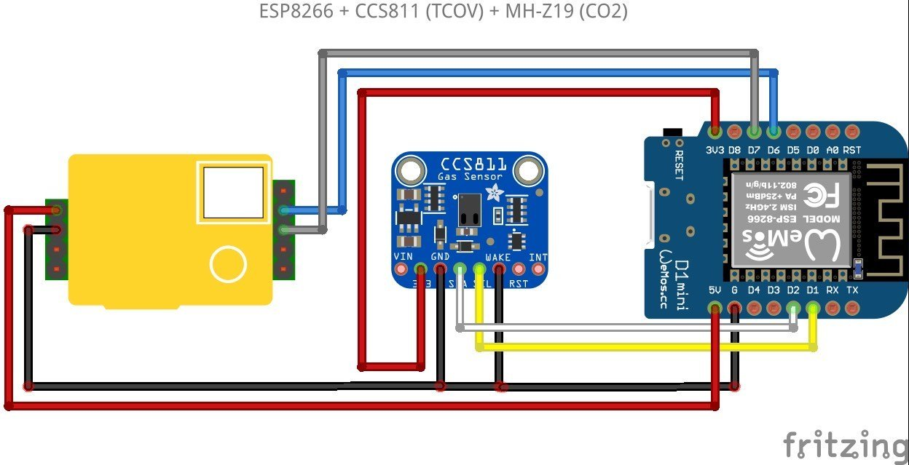

***CO2-Messgerät/Ampel***

[Weitere Fotos in der Galerie auf Thingiverse](https://www.thingiverse.com/thing:4644826)

Ziel dieses IOT-Projekt war es, einen Bausatz für ein CO2-Messgerät für den Einsatz in Schul- bzw. Klassenräumen zu entwickeln. 

Das Sketch ist ein Beispiel und zeigt über die Neopixel ein Farbsignal in Form einer Farbampel an. Die genauen Sensorwerte werden zusätzlich auf einem Display ausgegeben und können über einen Touch-Button an der Gehäuseseite ausgewählt werden. 

Achtung: In der aktuellen Version wird der HelTec Lora WiFi v2 als Mikrocontroller benutzt. Sensordaten werden außerdem nur per LoRaWAN übertragen. Eine WiFi Variante mit einem ESP8266 folgt.

Gemessen werden Temperatur (C), Feuchte (%), CO2 (ppm), Luftdruck(hPa) und die Luftqualität (flüchtige organische Verbindungen, VOC).

Die Sensordaten werden außerdem via **LoRa WAN ** an thethingsnetwork übertragen und von dort aus auf thingsspeak.com grafisch aufbereitet.

In weiteren Schritten soll das modular aufgebaute Gehäuse erweitert werden, um zu demonstrieren, dass die bisherigen Funktionen leicht durch andere Sensoren ergänzt oder ersetzt werden können. In Arbeit ist ein alternativer Gehäusedeckel mit größerem 1.8" TFT Diplay, welches das CO2 Symbol ersetzt und zeigt, dass das Gerät auch vertikal aufgestellt werden kann. Außerdem ist der Austausch des BlueDot Luftsensors durch einen dB Sensor geplant, damit aus einem CO2 Messgerät ohne Aufwand ein Schallpegel-Messgerät wird. Denkbar sind auch Mesh-Wegweiser oder die Erfassung der Bodenfeuchte von Klassenzimmerpflanzen.

In dieser Version wird der Mikrocontroller in Verbindung mit einem günstigen MH-Z19B Infrarot CO2 Sensor und einen BME680 Luftqualitätssensor benutzt. Außerdem 8 Neopixel (WS2812b) und ein Touch-Button Sensor. Bis auf den CO2 Sensor, der mit 5V betrieben wird, reicht für alles andere 3.3V. Der CO2 Sensor wird seriell über die RX/TX Pins abgefragt. Der Luftqualitätssensor kommuniziert über den i2c bus (SDA:Pin 21, SCK:Pin 22). Die Neopixel müssen mit PIN 25 am Mikrocontroller verbunden werden. Der Touch-Button ist t4 im Sketch, aber es können auch alle anderen verwendet werden, solange dies im Sketch auch angegeben wird.

**Gehäuse** (Alle Bauteile wurden mit TinkerCad.com entworfen)

https://www.thingiverse.com/thing:4644826
(Alle Druckvorlagen sind Prototypen und befinden sich im Repository, nicht alle sind vollständig getestet.)

Je nach Druckeinstellungen und Material können die Ergebnisse etwas abweichen. Als Material wurde PLA Filament in Holzoptik (Sunlu, Farbe Buche), Carbonschwarz sowie transparentes Material (mit photolumineszierenden/phosphoreszierenden Pigmenten) benutzt. Temperatur zwischen 195C und 200C im HotEnd sowie 58C - 60C auf dem Druckbett. Gedruckt mit einem AnyCubic I3 Mega und Cura 4.7.1 als Slicer. Ohne Stützstrukturen gedruckt.
Achtung: Es befinden sich weitere Gehäuseteile für die WiFi Variante im Verzeichnis, allerdings sind diese Druckvorlagen noch nicht vollständig getestet.
*Druckdauer für alle Druckobjekte: ca. ~8 Stunden*

**Verwendete Libraries/ Sketch (Arduino IDE):**                                        
-  Alle Libraries, die im Sketch benutzt werden, können über den Library Manager der Arduino IDE installiert werden.

**Boardmanager for Heltec ESP32 Mikrocontroller:**
- Alternative: https://resource.heltec.cn/download/package_heltec_esp32_index.json (newer and more examples)
- https://dl.espressif.com/dl/package_esp32_index.json

**Boardmanager for ESP8266 Mikrocontroller:**
http://arduino.esp8266.com/stable/package_esp8266com_index.json

**Wiring/Verkabelung:**

| BME680 | Heltec | ESP8266|
| ------ | ------ |-------|
| 3,3V | 3,3V | 3,3V |
| GND | GND | GND | 
| SDA | 22 | D2 |
| SCL | 21 | D1 |

| MH-Z19B | Heltec | ESP8266
| ------ | ------ |-------|
| 5V | 5V | Vin
| GND | GND | GND|
| TX | RX PIN | RX Pin
| RX | TX PIN | TX Pin

| Neopixel WS2812 | Heltec | ESP8266
| ------ | ------ |------ |
| GND | GND | GND |
| Din | 25 | D8 |
| 3,3V | 3,3V | 3,3V|

| Touch-Button | Heltec | ESP8266
| ------ | ------ | ------|
| GND | GND | GND |
| Din | 13 | D7 |
| 3,3V | 3,3V | 3,3V

**Kabelfarben:**

- 5V / GND = rot/schwarz
- 3.3V / GND = weiß/schwarz
- i2c sda = blau 
- i2c sck = grün
- Seriell RX = orange
- Seriell TX = gelb
- Neopixel = lila
- Touch-Button = grau

**Fritzing für ESP32 (Heltec Wifi LoRa v2)**

**Fritzing für ESP8266 (Amica)**

